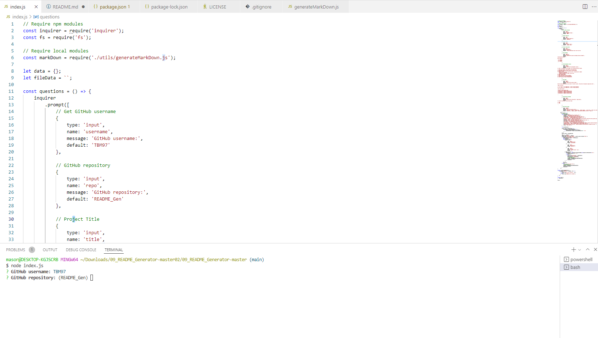

# README Generator

You can quickly and easily generate a README file by using a command-line application to generate one. This allows the project creator to devote more time working on the project.

## Badges

Code quality and validation

Repository Status

License

## Table of contents

- [Title](#title)
  - [Badges](#badges)
  - [Table of contents](#table-of-contents)
  - [The challenge](#the-challenge)
  - [The development process](#the-development-process)
  - [The Output](#the-output)
  - [Installation and Usage](#installation-and-usage)
  - [Credits, tools and other references](#credits-tools-and-other-references)
  - [Contributing](#contributing)
  - [Questions](#questions)

## The challenge

Challenge description ...
When creating an open source project on GitHub, it’s important to have a high-quality README for the app. This should include what the app is for, how to use the app, how to install it, how to report issues, and how to make contributions—this last part increases the likelihood that other developers will contribute to the success of the project.

Main elements:

- [x] Node
- [x] Bootstrap
- [x] Js

## The development process

In order to accomplish the challenge, the following steps were taken:

1. Define the purpose, and concept of the application.
2. Define MVPs (Minimum Viable Products) and due dates.
3. Research assets.
4. Define and build the base layout and grid, considering two stages:
   - Mobile-first approach.
   - Responsive design for larger screen sizes.
5. Create functionality.
6. Apply semantic HTML.
7. Asses valid HTML with W3C validator.
8. Benchmark the site with WebsiteGrader.
9. Final review and proper documentation.

## The Output

With the described process we were able to create a useful, efficient and responsive application that ...

**User stories**

1. AS A developer I WANT a README generator SO THAT I can quickly create a professional README for a new project

**The application**

## Installation and Usage

The project was uploaded to [GitHub](https://github.com/) at the following repository:
[https://github.com/TBM97/README_Gen](https://github.com/TBM97/README_Gen)

You can access the deployed application with the GitHup Pages link:
[https://TBM97.github.io/README_Gen/](https://TBM97.github.io/README_Gen/)

To install the project follow these steps:

1. npm i

## Credits, tools and other references

**Third Party Assets**

[Bootstrap](https://getbootstrap.com/)

[Website Grader](https://website.grader.com/)

[Markup Validation Service](https://validator.w3.org/)

Other asset

## Contributing

- Pull requests are welcome.
- For major changes, please open an issue first to discuss what you would like to change.
- Please make sure to update tests as appropriate.

## Questions

If you have questions or you want to share comments, we will be glad to hear from you. Please contact us at masonurrabas@gmail.com.

